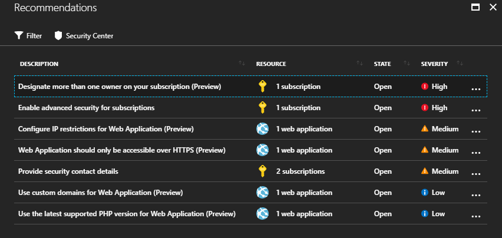

# Azure Security Notes

Notes for Azure Security Presentation

## Azure Security

Specifically content for developers including websites, web services, web apps, and database/data warehouse.

# Glossary

## Azure Security General

* https://www.microsoft.com/en-us/azureessentials - Security Option
* https://docs.microsoft.com/en-us/azure/security/azure-security
* https://docs.microsoft.com/en-us/azure/security/security-best-practices-and-patterns
* https://www.microsoft.com/handsonlabs/selfpacedlabs#keywords=security&page=1&sort=Newest
* https://www.edx.org/course/microsoft-azure-security-services-0
* https://github.com/MicrosoftDocs/azure-docs/blob/master/articles/security/security-best-practices-and-patterns.md

## Azure Security Center

* https://docs.microsoft.com/en-us/azure/security-center/security-center-planning-and-operations-guide
* https://docs.microsoft.com/en-us/azure/security-center/security-center-faq
* https://www.microsoft.com/en-us/azureessentials/Pivot/AzureEssentials/SecurityCenter/Learn
* https://docs.microsoft.com/en-us/azure/security-center/
* https://mva.microsoft.com/en-US/training-courses/introduction-to-azure-security-center-16614?l=BUOzJ6znC_9504300474
* https://mva.microsoft.com/en-US/training-courses/hybrid-cloud-workload-protection-with-azure-security-center-18173?l=Ld0LK42jE_006218965
* https://channel9.msdn.com/Blogs/Azure-Security-Videos

## Encryption

* https://docs.microsoft.com/en-us/azure/storage/common/storage-service-encryption
* https://docs.microsoft.com/en-us/azure/security/azure-security-encryption-atrest
* https://docs.microsoft.com/en-us/azure/security/azure-security-data-encryption-best-practices
* https://docs.microsoft.com/en-us/azure/security/security-azure-encryption-overview
* https://azure.microsoft.com/en-us/updates/azure-backup-sse-encryption-at-rest/
* https://docs.microsoft.com/en-us/azure/storage/common/storage-service-encryption-customer-managed-keys
* https://azure.microsoft.com/en-us/blog/announcing-default-encryption-for-azure-blobs-files-table-and-queue-storage/

## Storage Security

* https://docs.microsoft.com/en-us/azure/storage/common/storage-security-guide
* https://docs.microsoft.com/en-us/azure/security/azure-security-disk-encryption-overview

## Network Security

* https://docs.microsoft.com/en-us/azure/security/azure-security-network-security-best-practices
* https://docs.microsoft.com/en-us/azure/application-gateway/application-gateway-web-application-firewall-overview
* https://docs.microsoft.com/en-us/azure/virtual-network/security-overview
* https://docs.microsoft.com/en-us/azure/virtual-network/ddos-protection-overview
* https://docs.microsoft.com/en-us/azure/virtual-network/virtual-network-vnet-plan-design-arm

## Azure Advisor

Example -

* https://docs.microsoft.com/en-us/azure/advisor/advisor-overview

## Identity Security

* https://docs.microsoft.com/en-us/azure/security/azure-security-identity-management-best-practices

## RBAC

* https://docs.microsoft.com/en-us/azure/role-based-access-control/overview

### Azure Admin Portal

* https://docs.microsoft.com/en-us/azure/role-based-access-control/role-assignments-portal

## Development Security

### Azure Key Vault

* https://docs.microsoft.com/en-us/azure/key-vault/key-vault-whatis

### Virtual Network Servivce EndPoints

* https://docs.microsoft.com/en-us/azure/virtual-network/virtual-network-service-endpoints-overview
* https://docs.microsoft.com/en-us/azure/virtual-network/tutorial-restrict-network-access-to-resources

## Database Security

### SQL

* https://docs.microsoft.com/en-us/sql/relational-databases/security/encryption/transparent-data-encryption-azure-sql?view=azuresqldb-current
* https://docs.microsoft.com/en-us/azure/sql-database/sql-database-security-overview
* https://docs.microsoft.com/en-us/azure/sql-database/sql-database-always-encrypted-azure-key-vault

### Cosmos DB

* https://docs.microsoft.com/en-us/azure/cosmos-db/database-encryption-at-rest
* https://docs.microsoft.com/en-us/azure/cosmos-db/database-security

## Quick Deployment

* https://github.com/Azure/azure-quickstart-templates

## Azure Security Blog

* https://azure.microsoft.com/en-us/blog/topics/security/

## Azure Marketplace - Security Solutions

* https://azuremarketplace.microsoft.com/en-us/marketplace/apps/category/security-identity

## Other 3rd Party solutions

* https://cloudcheckr.com/
* https://www.cloudhealthtech.com/

## Security Information & Event Management (SIEM)

* https://www.logrhythm.com/
* https://www.splunk.com/

## Microsoft Security General

* https://www.microsoft.com/en-us/trustcenter/default.aspx
